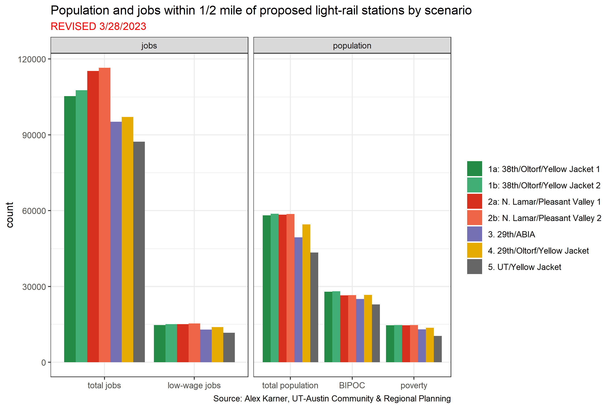

# project-connect-equity

On March 31, the [Austin Transtit Partnership (ATP)](https://www.atptx.org/) released five (really seven, or nine, depending on how you count) proposed scenarios for light rail in Austin. The new scenarios were necessitated by cost overruns associated with the designs included in the program's "Initial Vision" presented to voters back in 2020. ATP is trying to keep the light-rail components of the project within the originally scoped budget, so the new alignments are a substantial reduction. 

While there is [some information available](https://publicinput.com/lightrailopenhouse) about the relative performance of the different alternatives, it mostly focuses on design issues related to things like utility relocation, regrading needed to facilitate rail vehicles, or visual impacts. I'm more concerned with the number of people and jobs that the alternatives will serve. The information linked above does include some qualitative measures of access to opportunities, but the level of detail provided is not sufficient to make a robust comparison between alternatives. 

To do a proper analysis of the utility of different alternatives, ideally we would examine *access*--how easily people can get to the things that they need (work, school, healthcare, recreation, places of worship, etc.) under the different alternatives. We can't undertake a true access analysis now because we don't know how often the light-rail will run and more importantly, we have no idea how the bus network will be reconfigured to feed into the new system. 

Here, I've done the next best thing and looked at the number of people and jobs located near light rail (within a half-mile walk along the existing pedestrian network) under each of the alternatives. These are:

* 1a: 38th/Oltorf/Yellow Jacket 1
* 1b: 38th/Oltorf/Yellow Jacket 2
* 2a: N. Lamar/Pleasant Valley 1
* 2b: N. Lamar/Pleasant Valley 2
* 3: 29th/ABIA
* 4: 29th/Oltorf/Yellow Jacket
* 5: UT/Yellow Jacket

I build the included GeoJSON manually, using published maps. I generated half-mile service areas using ArcGIS Pro. The demographic analysis was conducted in R and relied heavily on [Kyle Walker's packages](https://walker-data.com/) and [the tidyverse](https://www.tidyverse.org/). 

The analysis shows that scenarios 1 and 2 by far outperform the others in terms of population and jobs located close to light rail. Scenario 4 has decent population coverage, owing to its extension to Yellow Jacket, but it doesn't capture nearly as many jobs as scenarios 1 and 2. 

